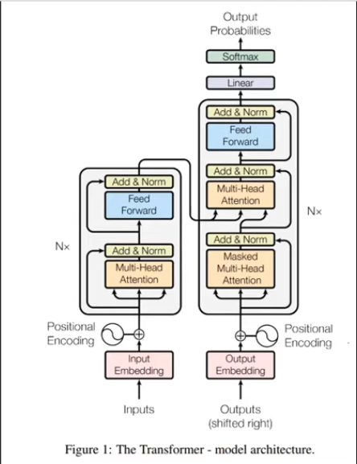
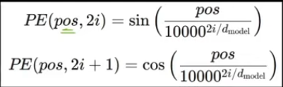
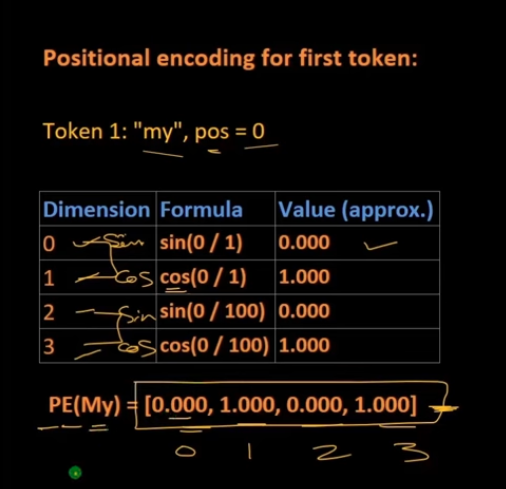

## Positional Encoding



### Why Positional Encoding ?

it tells about the position of the token an dit's only calculated once.

```code
Input - "my name is Tony and i love coding"
Tokenizer - [Tokens] -> [Ids]
Tokens = ["my", "name", "is", "Tony", "and", "i", "love", "coding"]
Ids = [101, 233, 31, 987, 45, 12, 34, 556]
```




