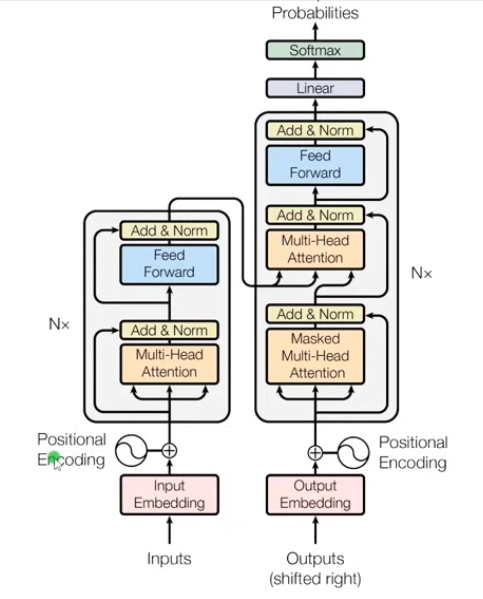
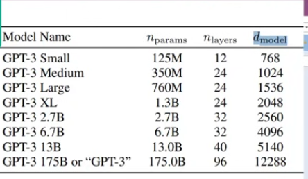
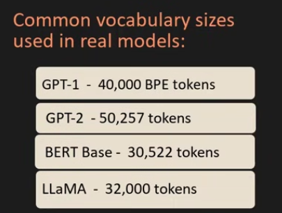
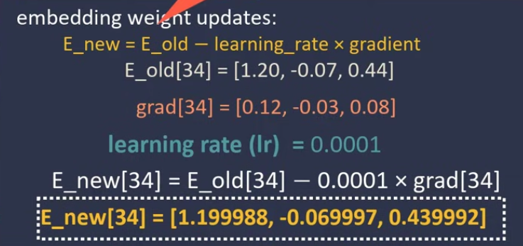

# Transformer Architecture: “Attention is All You Need”



## Step 1 - Tokenizer

```code
Input - "my name is Tony and i love coding"
Tokenizer - [Tokens] -> [Ids]
Tokens = ["my", "name", "is", "Tony", "and", "i", "love", "coding"]
Ids = [101, 233, 31, 987, 45, 12, 34, 556]
```

## Step 2 - Input Embedding

"my" = [0.2, -0.7, 0.1,...] (embedding vector is an array of floating numbers)

Every tiken will have a single embedding vector.

### How many values inside the enbedding vector ?

Lwngth dependes on `d_model`


### What kind of values will there be initially ?

initially it has random values.
Embeddings are `trainable parameters`

> Vocabulary Size = total number of unique tokens your tokenizer can produce.

> Embedding layer will produce a matrix (lookup table)

### How does the embedding matrix actually get learned during training?

> Shape of matrix: (vocab_size \* embedding_dim)

example :

```code
vocab_size = 50000 (aka total tokens)
embedding_dim = 512
Shape of marix = 50000 \* 512
```

### How these parameters of embedding matrix are updated ?

After every epoch, the new embedding will update.

> E_new = E_old - learning_rate \* gradient



## Summary

1. `Tokenizer` - Splits the raw texts into tokens
2. `Embedding Layer` - Embeddijng layer will create an embedding vector with the random values and the length will depndnd on the `d_model` value.
3. `Transformer Layer` -
4. `Loss Computation` - back propogation .
